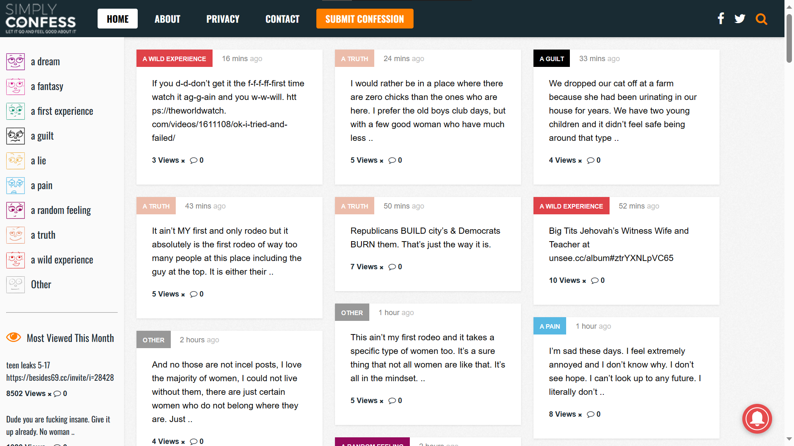
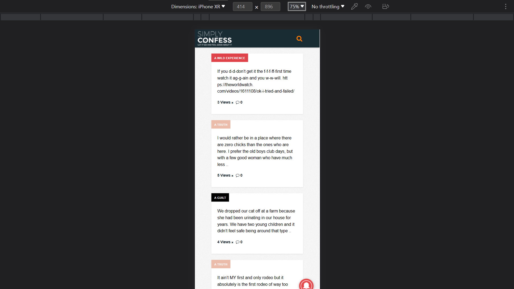
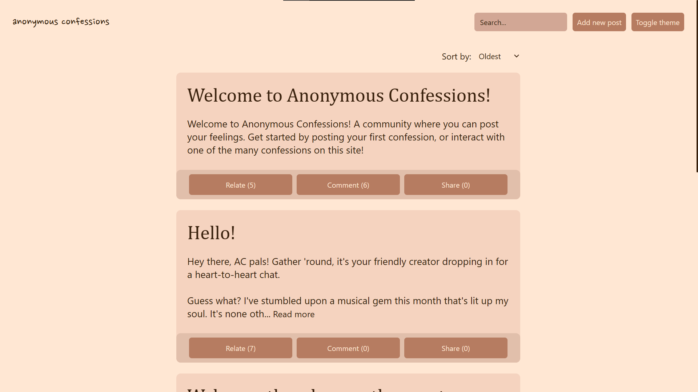

# Anonymous Confessions

A platform where people share feelings, anonymously.

## Feature List

These are the features that are either in Anonymous Confessions, or is still implementing:

### Deployed

- [x] Dark & Light themes
- [x] Post sort
- [x] Post comments
- [x] Post search
- [x] Post sharing
- [x] Mobile friendly layout
- [x] Filtered posts (AI moderated)
- [x] "I relate" button

### Planned/Implementing

- [ ] Custom theme store
- [ ] "I relate" button for comments
- [ ] Comment replies
- [ ] Filtered comments
- [ ] Post tags

## Inspiration

I feel like that most confession sites are bland, and the design doesn't really reflect a place where you can rant stuff.

One of them are insanely unmoderated, and have topics that are not really related. Like, what does "Big T\*ts Jehovah’s Witness Wife and Teacher" have to do with confessing?

And this site on mobile doesn't even let you post confessions!

Oh, you're on a phone? Too bad, you can't post. >:\(

And, the user interface doesn't feel trusting enough that I'd actually post stuff here.

This is one of the reasons why I built Anonymous Confessions, a place that's designed to encourage, not to expel.

I picked a brown-ish color palette, some say it's a mocha color pallete, which really suited my vision on what the site should look like. I'd like to imagine this place as a campsite, where people talk about things in the campfire.

I also used Google's Perspective API to filter out unwanted posts through the power of **✨AI✨**. This should minimize the "Big T\*ts Jehovah’s Witness Wife and Teacher" type of bullsh\*t you see on unmoderated sites.

I also added a slow-mode countdown, to at least circumvent spam posts from happening.

I also added the "I relate" button, suggested by a friend of mine, [@maurosGithub](https://github.com/maurosGithub). The button acts as a like button for posts. Pressing it indicates that you relate to this post. Comment and share buttons are self-explanatory.

I also added searching and sorting by popularity, newest, and oldest, just for the convenience it gives to me and hopefully for other users.

That's all for me, hope you enjoy the site, and I'll catch you on the flip side, when I post there occasionally .👋
